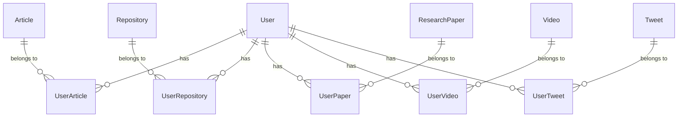

# Global Content + User Junction Tables Architecture

Store each piece of scraped content **once** globally, then link users to it via lightweight junction (M2M through) tables. This eliminates data duplication, saves disk space, and keeps the deduplication pipeline efficient.

## Architecture Overview

**How it works:**
1. Scraper fetches an item → global dedup pipeline checks Redis (unchanged)
2. If item is **new**: save to DB, create user↔item junction row
3. If item is a **duplicate**: skip the save, but still create the user↔item junction row (so the user "subscribes" to it)
4. Views query items via the junction table: `Article.objects.filter(user_articles__user=request.user)`

---

## Proposed Changes

### 1. Models — Add Junction Tables

Each content app gets a thin junction model with a `unique_together` constraint.

#### [MODIFY] [articles/models.py](file:///home/hayredin/Documents/synapse/backend/apps/articles/models.py)
- Remove [user](file:///home/hayredin/Documents/synapse/backend/apps/agents/tasks.py#387-410) ForeignKey from [Article](file:///home/hayredin/Documents/synapse/backend/apps/articles/models.py#34-80)
- Add `UserArticle(user, article, added_at)` junction model with `unique_together = ('user', 'article')`

#### [MODIFY] [repositories/models.py](file:///home/hayredin/Documents/synapse/backend/apps/repositories/models.py)
- Remove [user](file:///home/hayredin/Documents/synapse/backend/apps/agents/tasks.py#387-410) ForeignKey from [Repository](file:///home/hayredin/Documents/synapse/backend/apps/repositories/models.py#8-62)
- Add `UserRepository(user, repository, added_at)` with `unique_together`

#### [MODIFY] [papers/models.py](file:///home/hayredin/Documents/synapse/backend/apps/papers/models.py)
- Remove [user](file:///home/hayredin/Documents/synapse/backend/apps/agents/tasks.py#387-410) ForeignKey from [ResearchPaper](file:///home/hayredin/Documents/synapse/backend/apps/papers/models.py#8-44)
- Add `UserPaper(user, paper, added_at)` with `unique_together`

#### [MODIFY] [videos/models.py](file:///home/hayredin/Documents/synapse/backend/apps/videos/models.py)
- Remove [user](file:///home/hayredin/Documents/synapse/backend/apps/agents/tasks.py#387-410) ForeignKey from [Video](file:///home/hayredin/Documents/synapse/backend/apps/videos/models.py#7-38)
- Add `UserVideo(user, video, added_at)` with `unique_together`

#### [MODIFY] [tweets/models.py](file:///home/hayredin/Documents/synapse/backend/apps/tweets/models.py)
- Remove [user](file:///home/hayredin/Documents/synapse/backend/apps/agents/tasks.py#387-410) ForeignKey from [Tweet](file:///home/hayredin/Documents/synapse/backend/apps/tweets/models.py#9-63)
- Add `UserTweet(user, tweet, added_at)` with `unique_together`

---

### 2. Database Pipeline — Link Users to Global Items

#### [MODIFY] [database.py](file:///home/hayredin/Documents/synapse/scraper/pipelines/database.py)
- In each `_save_*` method: after `update_or_create` of the global item, [get_or_create](file:///home/hayredin/Documents/synapse/backend/apps/billing/stripe_service.py#42-69) the junction row linking the resolved user to the item
- Remove [user](file:///home/hayredin/Documents/synapse/backend/apps/agents/tasks.py#387-410) from the `defaults` dict passed to `update_or_create`

---

### 3. Deduplication Pipeline — Revert to Global + Pass-Through for Linked Users

#### [MODIFY] [deduplicate.py](file:///home/hayredin/Documents/synapse/scraper/pipelines/deduplicate.py)
- Revert Redis keys back to global scope (remove `:usr_` suffix)
- When a duplicate is detected: instead of raising `DropItem`, set `item['_is_existing'] = True` and **pass it through** so the DB pipeline can still create the user junction row
- Only raise `DropItem` when there is no `user_id` context (anonymous/system scraping of true duplicates)

---

### 4. Views — Query Via Junction Tables

#### [MODIFY] [articles/views.py](file:///home/hayredin/Documents/synapse/backend/apps/articles/views.py)
- Change `qs.filter(user=self.request.user)` → `qs.filter(user_articles__user=self.request.user)`

#### [MODIFY] [repositories/views.py](file:///home/hayredin/Documents/synapse/backend/apps/repositories/views.py)
- Change `qs.filter(user=self.request.user)` → `qs.filter(user_repositories__user=self.request.user)` (all 4 endpoints)

#### [MODIFY] [videos/views.py](file:///home/hayredin/Documents/synapse/backend/apps/videos/views.py)
- Change `qs.filter(user=self.request.user)` → `qs.filter(user_videos__user=self.request.user)`

#### [MODIFY] [tweets/views.py](file:///home/hayredin/Documents/synapse/backend/apps/tweets/views.py)
- Change `qs.filter(user=self.request.user)` → `qs.filter(user_tweets__user=self.request.user)`

#### [MODIFY] [papers/views.py](file:///home/hayredin/Documents/synapse/backend/apps/papers/views.py)
- Change `qs.filter(user=self.request.user)` → `qs.filter(user_papers__user=self.request.user)`

---

### 5. Migrations

- Auto-generate Django migrations to:
  1. Create the 5 new junction tables
  2. Migrate existing [user](file:///home/hayredin/Documents/synapse/backend/apps/agents/tasks.py#387-410) FK data into the junction tables
  3. Remove the [user](file:///home/hayredin/Documents/synapse/backend/apps/agents/tasks.py#387-410) FK columns from the content tables

---

## Verification Plan

### Automated Tests
1. `python manage.py makemigrations && python manage.py migrate` — ensure migration graph is clean
2. Run the GitHub spider manually with `SYNAPSE_USER_ID=<id>` and confirm junction rows are created
3. Query the API endpoint and confirm the user sees items linked via junction table

### Manual Verification
1. Trigger Workflow A11 after migration and confirm all feeds populate
2. Log in as a second user and confirm they see only items linked to their account
